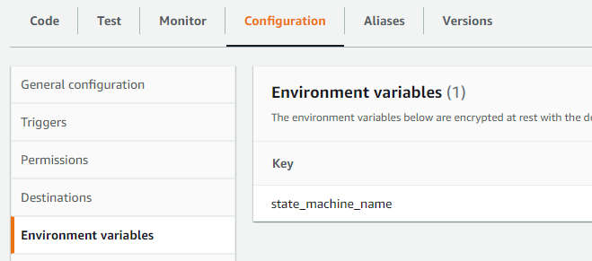

# S3-StepFunc-SageMaker

# AWS 服務串接

# Lambda

前接 s3 Bucket : 有 Put Event 時觸發

後接 Step Function

```python
import json
import urllib.parse
import boto3
import os

print('Loading function')

s3 = boto3.client('s3')
client = boto3.client('stepfunctions')
state_machine_name = os.environ.get('state_machine_name')
runtime_region = os.environ['AWS_REGION']

def lambda_handler(event, context):
    aws_account_id = context.invoked_function_arn.split(":")[4]
    print(aws_account_id)
    #print("Received event: " + json.dumps(event, indent=2))
    my_state_machine_arn = f"arn:aws:states:{runtime_region}:{aws_account_id}:stateMachine:{state_machine_name}"
    print(my_state_machine_arn)
    # Get the object from the event and show its content type
    bucket = event['Records'][0]['s3']['bucket']['name']
    key = urllib.parse.unquote_plus(event['Records'][0]['s3']['object']['key'], encoding='utf-8')
    record = event['Records'][0]
    print(record)
    for record in event['Records']:
        response = client.start_execution(
            stateMachineArn=my_state_machine_arn,
            input=json.dumps(record['s3'])
        )
```

## variable

到 Configuration > Environment variables 設定參數

此處設定下面要接的 Step function 名稱



## Test

測試資料

```json
{
  "Records": [
    {
      "eventVersion": "2.0",
      "eventSource": "aws:s3",
      "awsRegion": "us-east-1",
      "eventTime": "1970-01-01T00:00:00.000Z",
      "eventName": "ObjectCreated:Put",
      "userIdentity": {
        "principalId": "EXAMPLE"
      },
      "requestParameters": {
        "sourceIPAddress": "127.0.0.1"
      },
      "responseElements": {
        "x-amz-request-id": "EXAMPLE123456789",
        "x-amz-id-2": "EXAMPLE123/5678abcdefghijklambdaisawesome/mnopqrstuvwxyzABCDEFGH"
      },
      "s3": {
        "s3SchemaVersion": "1.0",
        "configurationId": "testConfigRule",
        "bucket": {
          "name": "example-bucket",
          "ownerIdentity": {
            "principalId": "EXAMPLE"
          },
          "arn": "arn:aws:s3:::bucket-name-20211230"
        },
        "object": {
          "key": "meta-data/partition_2333.csv",
          "size": 1024,
          "eTag": "0123456789abcdef0123456789abcdef",
          "sequencer": "0A1B2C3D4E5F678901"
        }
      }
    }
  ]
}
```

# Step function


<aside>
👉 ECR Image 還是空的，所以失敗

</aside>

## Task 解釋

1. get file name : 應該可去掉
2. FileName formate : 只看檔名檢查是不是  csv 檔 
3. Lambda Invoke : 檢查 檔名得到檔案批次數字
4. Standardization: x' = (x - x̄) / σ : 將 s3 的 object 當作 Inpunt 起動 SageMakerProcess

<aside>
⚠️ 記得把 {account-id} 換成自己的

</aside>

```json
{
    "StartAt": "get file name",
    "States": {
      "get file name": {
        "Type": "Pass",
        "Next": "FileName formate"
      },
      "FileName formate": {
        "Type": "Choice",
        "Choices": [
          {
            "Not": {
              "Variable": "$.object.key",
              "StringMatches": "*_*.csv"
            },
            "Next": "Fail"
          },
          {
            "Variable": "$.object.key",
            "StringMatches": "*_*.csv",
            "Next": "Lambda Invoke"
          }
        ],
        "Default": "Fail"
      },
      "Lambda Invoke": {
        "Type": "Task",
        "Resource": "arn:aws:states:::lambda:invoke",
        "Parameters": {
          "FunctionName": "arn:aws:lambda:ap-northeast-1:{accound-id}:function:GetID:$LATEST",
          "Payload": {
            "key1": "sampleValue1",
            "object.$": "$.object.key"
          }
        },
        "Retry": [
          {
            "ErrorEquals": [
              "Lambda.ServiceException",
              "Lambda.AWSLambdaException",
              "Lambda.SdkClientException"
            ],
            "IntervalSeconds": 2,
            "MaxAttempts": 6,
            "BackoffRate": 2
          }
        ],
        "Next": "IsBatch_idNumber",
        "ResultPath": "$.batch_id",
        "ResultSelector": {
          "value.$": "$.Payload.body.batch_id"
        }
      },
      "IsBatch_idNumber": {
        "Type": "Choice",
        "Choices": [
          {
            "Not": {
              "Variable": "$.batch_id.value",
              "IsNumeric": true
            },
            "Next": "Fail"
          }
        ],
        "Default": "Standardization: x' = (x - x̄) / σ"
      },
      "Fail": {
        "Type": "Fail",
        "Cause": "檔名不符合格式",
        "Error": "$.object.key"
      },
      "Standardization: x' = (x - x̄) / σ": {
        "Resource": "arn:aws:states:::sagemaker:createProcessingJob.sync",
        "Parameters": {
          "ProcessingResources": {
            "ClusterConfig": {
              "InstanceCount": 1,
              "InstanceType": "ml.t3.medium",
              "VolumeSizeInGB": 1
            }
          },
          "ProcessingInputs": [
            {
              "InputName": "input-1",
              "S3Input": {
                "S3Uri.$": "States.Format('s3://{}/{}', $.bucket.name, $.object.key)",
                "LocalPath": "/opt/ml/processing/input",
                "S3DataType": "S3Prefix",
                "S3InputMode": "File",
                "S3DataDistributionType": "FullyReplicated",
                "S3CompressionType": "None"
              }
            },
            {
              "InputName": "code",
              "S3Input": {
                "S3Uri.$": "States.Format('s3://{}/code/app.py', $.bucket.name)",
                "LocalPath": "/opt/ml/processing/input/code",
                "S3DataType": "S3Prefix",
                "S3InputMode": "File",
                "S3DataDistributionType": "FullyReplicated",
                "S3CompressionType": "None"
              }
            }
          ],
          "ProcessingOutputConfig": {
            "Outputs": [
              {
                "OutputName": "train_data",
                "S3Output": {
                  "S3Uri.$": "States.Format('s3://{}/prediction-data/{}', $.bucket.name, $.batch_id)",
                  "LocalPath": "/opt/ml/processing/output/train",
                  "S3UploadMode": "EndOfJob"
                }
              }
            ]
          },
          "AppSpecification": {
            "ImageUri": "{accound-id}.dkr.ecr.us-east-1.amazonaws.com/image-name",
            "ContainerEntrypoint": [
              "python3",
              "/opt/ml/processing/input/code/app.py"
            ]
          },
          "StoppingCondition": {
            "MaxRuntimeInSeconds": 300
          },
          "RoleArn": "arn:aws:iam::{accound-id}:role/SageMakerAPIExecutionRole",
          "ProcessingJobName.$": "States.Format('project-name-{}-{}', $.batch_id.value, $$.Execution.Name)"
        },
        "Type": "Task",
        "Catch": [
          {
            "ErrorEquals": [
              "States.ALL"
            ],
            "Next": "SageMaker error",
            "ResultPath": "$.result.error"
          }
        ],
        "Next": "Success"
      },
      "SageMaker error": {
        "Type": "Fail"
      },
      "Success": {
        "Type": "Succeed"
      }
    }
  }
```

## Test

測試資料 : 前面 Lambda 傳來的

```json
{
  "s3SchemaVersion": "1.0",
  "configurationId": "testConfigRule",
  "bucket": {
    "name": "example-bucket",
    "ownerIdentity": {
      "principalId": "EXAMPLE"
    },
    "arn": "arn:aws:s3:::bucket-20211230"
  },
  "object": {
    "key": "meta-data/partition_2333.csv",
    "size": 1024,
    "eTag": "0123456789abcdef0123456789abcdef",
    "sequencer": "0A1B2C3D4E5F678901"
  }
}
```


## Lambda GetId

```jsx
exports.handler = async (event) => {
    console.log(event)
    const objectPath = event['object']

    const [fileName] = objectPath.split('/').slice(-1) 
    const fileNameWithoutExtension = fileName.split('.')[0]
    const batchId = Number(fileNameWithoutExtension.split('partition_').slice(-1)[0])
    console.log('id', batchId)

	if(!Number.isInteger(batchId)) {
    	const response = {
        statusCode: 400,
        error: "batch_id is not integer",
    	}
        console.log(response)
        return response
    }

	const response = {
      statusCode: 200,
      body: {
        batch_id: batchId
      },
    }
     
	console.log(response)
    return response;
};
```